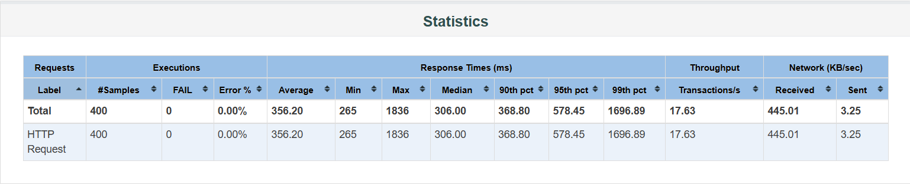
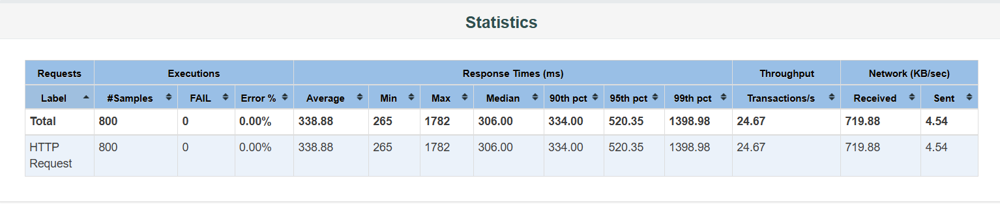
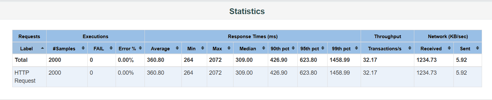
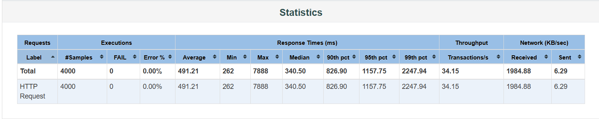

# 性能测试报告：待办事项应用

## 1. 测试背景
- **被测系统**：`https://furikae.pythonanywhere.com`（待办事项管理应用）
- **测试目的**：评估系统在不同并发用户下的性能表现，找出性能拐点，为容量规划提供依据。

## 2. 测试环境
- **工具**：Apache JMeter 5.6.3
- **测试脚本**：模拟用户添加任务（POST /items）和获取任务列表（GET /items）
- **服务器**：PythonAnywhere 免费版（1个Worker，单核）
- **网络**：本地宽带（100Mbps）

## 3. 测试方法
- **阶梯加压**：分别测试 10、20、50、100 个并发用户（虚拟线程）
- **循环次数**：每个用户循环执行 10 次（总请求数 = 并发数 × 10）
- **启动时间**：Ramp-up 设置为与并发数相同（秒），即每秒启动 1 个用户，避免突发冲击
- **监控指标**：平均响应时间、95% 分位响应时间、吞吐量（请求/秒）、错误率

## 4. 测试结果

| 并发用户 | 平均响应时间(ms) | 95% 分位(ms) | 吞吐量(req/s) | 错误率 |
|----------|------------------|--------------|----------------|--------|
| 10       | 356.2            | 578.45       | 17.63          | 0%     |
| 20       | 338.88           | 520.35       | 24.67          | 0%     |
| 50       | 360.8            | 623.8        | 32.17          | 0%     |
| 100      | 491.21           | 1157.75      | 34.15          | 0%     |

## 5. 结果分析
- **10→20 并发**：平均响应时间略有下降（可能因网络波动），吞吐量明显提升，系统表现正常。
- **20→50 并发**：响应时间稳定在 360ms 左右，吞吐量持续增长，系统表现良好。
- **50→100 并发**：
  - 平均响应时间上升 36%（360 → 491 ms）
  - 95% 分位响应时间翻倍（624 → 1158 ms）
  - 吞吐量增长几乎停滞（32.2 → 34.2 req/s）
- **错误率**：始终为 0%，服务器未崩溃，但响应质量显著下降。

## 6. 结论与建议
- **性能拐点**：系统在 50 并发时性能良好，100 并发时响应时间急剧恶化，吞吐量达到瓶颈。建议将并发用户控制在 **50 以内**，以保证用户体验。
- **优化建议**：
  1. **短期**：前端限制同时请求数量，避免瞬时高峰。
  2. **中期**：优化后端代码，减少每个请求的处理时间（如数据库查询优化、增加缓存）。
  3. **长期**：升级服务器（如增加 Worker 数量或迁移到更高性能平台）。
- **后续测试**：若需精确拐点，可补充 70 并发测试，但当前范围已足够决策。

## 7. 附件
- JMeter 生成的 HTML 报告截图
  
  
  
  
- JMeter 生成的 HTML 报告：已保存在 `reports/` 文件夹中，打开各子目录的 `index.html` 可查看详细图表。

---

**报告编写人**：黄佳蕾 
**日期**：2026-04-18